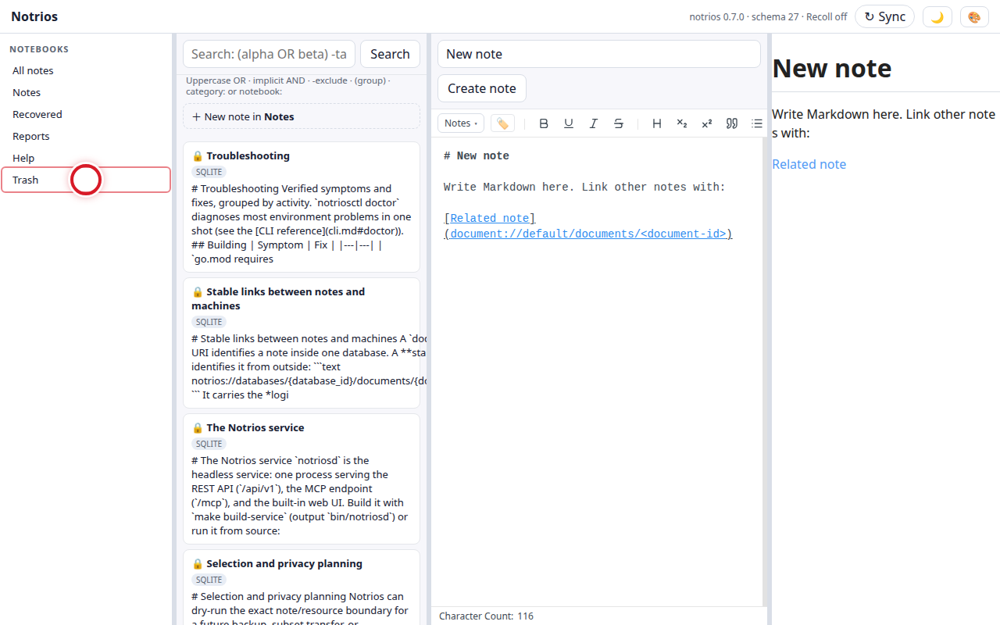

# GUI journeys

The [GUI guide](gui.md) describes what the GUI has in it. This page shows
you doing things with it: a task, the steps, and a picture of each step with the
place to click marked.

The same tasks are shown for the command line in
[Command-line journeys](journeys-cli.md). Where a task can only be done on one
of the two, both pages say so.

## Reading the pictures

Each screenshot carries two marks. The **thin outline** is the thing you are
clicking — how much of it is clickable. The **red circle** is the point the
click lands on.

The library in these pictures is a throwaway one made for the purpose. None of
it is anybody's notes.

## What the GUI does not do

**Tags are read-only here.** The sidebar lists them with note counts and you can
click one to search it, but there is no way to add a tag to a note or take one
off. To do that, use the command line —
[`notriosctl tags add` and `tags remove`](journeys-cli.md) — or the API. This is
a gap rather than a decision, and it is the one thing the GUI cannot do
that the command line can.

Importing, exporting, snapshots, profiles and publishing are command-line work
today. That is a gap rather than a rule: the desktop app runs on your machine
and could offer a directory picker for any of them. What genuinely cannot is the
browser mode, which has no access to arbitrary local paths.

## The journeys
<!-- notrios:generated:user:the-journeys:begin -->
<!-- source: go:github.com/renesugar/notrios/internal/docjourneys#(GUICatalogue).GUILines -->
Each task below lists its steps, with a picture of every one.

- **Find your way around** — See what the GUI is made of before changing anything in it.
  - The sidebar on the left lists your notebooks. Help is one of them: the documentation is seeded into your library as ordinary read-only notes, so you can search it alongside everything else.

    
- **Write a note, and read it back** — Create a note and get something into it.
  - Click New note. The note is created immediately and opens for editing; there is no dialog to fill in first.

    
  - Type into the editor. What you write is Markdown, and the preview beside it renders as you go.

    
- **Choose which notebook a note goes in** — File a note somewhere other than where it landed.
  - Start from a new note.

    
  - Open the notebook picker. It sits with the note rather than in a menu, because which notebook a note belongs to is part of the note.

    
- **Delete a note, and get it back** — Send a note to Trash and restore it, so you can see that deleting is reversible.
  - Trash sits at the bottom of the sidebar and is a place you can look in, not a countdown. Notes stay there until you empty it.

    
- **Tag a note** — Put a tag on the note you are writing, and take one off.
  - Start from a note. Tags belong to a note, so there has to be one open.

    
  - Open the tag control. It sits in the editor toolbar beside the notebook control, because both answer where this note belongs and both belong where you are typing. The label shows how many tags the note carries.

    
  - Type the tag. Tags are hierarchical, so `field/dusk` sits under `field`. Press Enter or use Add.

    
  - Add it. Each tag then appears as a chip with its own remove button, rather than as a comma-separated line you have to edit carefully.

    
<!-- notrios:generated:user:the-journeys:end -->

## Where these come from

Every picture above was taken by driving the real GUI. Nothing is a
mockup, and nothing was placed by hand: each mark is drawn from where the thing
being clicked actually was, so if a button moves the mark moves with it.

If a step here does not match what you see, that is a bug in Notrios or in this
page, and worth reporting either way.
