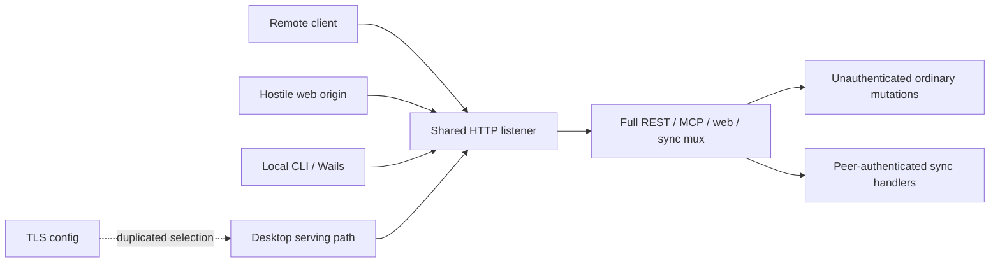
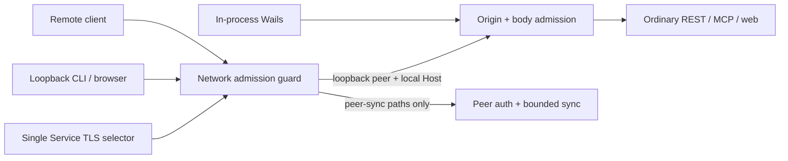
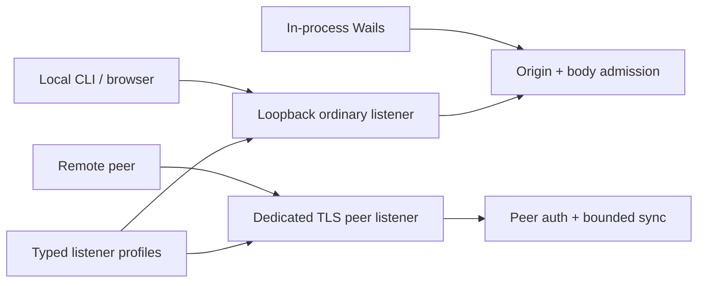

# Security Hardening Proposal: Own Network Admission In One Lifecycle Boundary

## Decision

Choose whether v0.7 should keep one listener with centralized admission or move
ordinary and peer traffic onto separate listeners. This decision is about
control ownership, not merely route naming: the same owner must select TLS,
classify the real network peer, admit browser origins, and bound request bytes.

## Executive Recommendation

There are two serious options. Option 1, **Central listener guard**, keeps one
listener but puts remote-versus-local admission and TLS selection at the
service boundary, with origin and body controls at HTTP admission. Option 2,
**Split local and peer listeners**, gives ordinary and peer traffic distinct
sockets and profiles.

I recommend Option 1 for v0.7 because it directly addresses the scanned paths
without changing peer URLs or the desktop lifecycle. Option 2 becomes
preferable if we decide to support authenticated remote ordinary APIs, reverse
proxies, or independently operated peer endpoints; those requirements need a
first-class deployment boundary rather than more exceptions in a shared guard.

## Evidence

I inspected the sealed findings and the affected service, HTTP, store, and
command entry points. Four findings share one structural condition: admission
policy was distributed after a single listener had already granted access to
the full mux.

| Evidence | Finding | What it establishes |
| --- | --- | --- |
| `csf_806a49159c767d9afd647cb6` | Non-loopback listener exposes unauthenticated ordinary APIs | The network server attached the full unauthenticated mux to remote-capable sockets. |
| `csf_ed7b60861f56c5e547852a9a` | Desktop command serves plaintext despite TLS configuration | Executables independently selected serving transport and drifted. |
| `csf_493daca733a8eb3401c88af2` | Cross-origin pages can mutate the loopback API | Browser-origin authorization did not exist at shared HTTP admission. |
| `csf_c86971e0236bb990154d64fa` | Ordinary request bodies are unbounded | JSON, MCP, HTTP resource, and store admission did not share canonical ceilings. |

The first two are observed lifecycle failures in `internal/service/service.go`
and `cmd/notrios/main.go`. The latter two are observed admission failures in
`internal/httpapi/server.go`, `internal/httpapi/mcp.go`, and
`internal/store/sqlite.go`. We infer from their spread that route handlers were
being asked to preserve properties that belong to the listener or admission
boundary.

## Current Design And Failure Mode

At the scanned revision, every TCP connection reached the same mux. Peer auth
was correctly local to sync routes, but nothing prevented a remote connection
from choosing an ordinary route instead. Separately, one executable chose TLS
and another chose plaintext. Once a request arrived, a hostile browser origin
and an oversized body met controls only on selected handlers.

That arrangement made the safe configuration a convention: bind loopback, use
the right binary, do not browse hostile pages, and do not send excessive bytes.
Each convention can hold most of the time while still leaving a supported
lifecycle path that violates the intended boundary.

## Desired Invariants

- Every external connection is classified from its actual peer address and
  final Host before an ordinary route can run; forwarding headers grant no
  authority.
- Only the peer-sync route family is remotely reachable, and its existing
  invitation or peer credential remains mandatory.
- All executables use one TLS/plain selector, and a partial TLS pair starts no
  listener.
- Every unsafe browser request is admitted only for the exact application
  origin or a recognized Wails origin.
- Ordinary JSON is one complete bounded value, and resource bytes cannot exceed
  the canonical object ceiling even through a non-HTTP caller.

## Constraints And Non-Goals

Loopback REST, MCP, web UI, Wails, SSH tunnels terminating on loopback, and
authenticated remote peer sync must remain compatible. v0.7 does not add a
general user-authentication scheme, trust forwarding headers, or support a
loopback reverse proxy as a security boundary. The 8 MiB JSON envelope must
still carry a worst-case escaped 1 MiB note, and the 16 GiB resource workflow
must remain streaming.

## Before Architecture

The before view shows why route-local controls were insufficient: all actors
crossed the same listener and full mux before the application distinguished
their authority.

The dangerous edge is `Listener --> Mux`: it carries no information about
whether the connection is allowed to select an ordinary route. Duplicated TLS
selection then changes the protection of that edge by executable.

## Options

### Option 1: Central Listener Guard

We keep one socket and make `Service` own network admission and transport
selection. A remote peer may enter only the sync route family. An ordinary
request must have a loopback peer and a local Host, which also prevents a DNS
rebinding name from becoming authority. The HTTP server then owns browser
origin and byte admission, while the store retains the final resource ceiling.
Wails continues calling the handler in-process and therefore does not pretend
to be a TCP peer.

The strongest case for this option is compatibility: no peer endpoint,
configuration shape, or process topology changes. Security improves because
the shared listener no longer means shared authority. What gives me pause is
the deployment assumption around proxies. A loopback proxy makes the real peer
unobservable, so supporting one would require authenticated proxy identity,
not `X-Forwarded-For` parsing.

| Change | Before | After | Security consequence | Cost |
| --- | --- | --- | --- | --- |
| Remote classification | Full mux sees every peer | Listener guard admits route family | Remote clients cannot select ordinary APIs | One small request check |
| TLS selection | Per executable | One Service method | Desktop/daemon drift is removed | Central lifecycle test seam |
| Browser admission | Handler convention | Central unsafe-method origin guard | Simple cross-origin mutations fail | Exact origin compatibility rules |
| Byte admission | Selected handlers | Shared JSON/HTTP/store bounds | Oversize and trailing-data bypasses close | Bounded decoder and streaming checks |

Rollback is a focused code reversion, although doing so would reopen the
findings; operational rollback should instead bind loopback and disable remote
sync. No migration of stored data or peer credentials is required.

### Option 2: Split Local And Peer Listeners

We give ordinary and peer traffic separate server instances. The ordinary
listener is structurally loopback-only; the peer listener registers only pair,
handshake, carrier, and backup routes and requires its TLS profile. Origin and
body controls remain necessary because they defend different actors and
alternate entry points.

This option makes the network boundary easiest to audit. A future general
remote API could receive its own authenticated listener rather than weakening
the local listener. It also contains failure and lets operators monitor peer
traffic separately. The cost is real: two addresses, shutdown paths, health
surfaces, configuration migrations, and peer URL compatibility. A port conflict
or partial startup creates a new reliability state that one listener does not
have.

| Change | Before | After | Security consequence | Cost |
| --- | --- | --- | --- | --- |
| Socket authority | Shared listener | Local and peer sockets | Wrong route family is not registered | Second server lifecycle |
| Configuration | One address plus sync flags | Two typed listener profiles | Unsafe combinations become easier to reject | Config and documentation migration |
| Failure domain | One listener | Partial independent availability | Peer failure need not stop local UI | Partial-start recovery and observability |
| Future remote API | More shared-mux policy | Separate authenticated profile | General auth cannot accidentally bless local routes | Additional protocol/product design |

We could roll this out with a compatibility period that derives the peer
address from the old address when unambiguous, then revert to Option 1 if dual
lifecycle acceptance fails. That migration is too broad for release closure,
but it is the cleaner basis for a genuinely supported remote service.

## Comparison

| Dimension | Option 1: Central guard | Option 2: Split listeners |
| --- | --- | --- |
| Security | Improves, high confidence, source-derived; one guard still owns path classification | Improves further, high confidence, source-derived; route families are socket-separated |
| Performance | Neutral, medium confidence; constant request checks; benchmark REST/sync request latency | Slight regression, low confidence; no per-request hop but more sockets; benchmark both listeners under concurrent load |
| Memory | Neutral, high confidence; bounded request state only | Slight regression, medium confidence; second server/listener state; compare idle and loaded RSS |
| Reliability | Improves drift resistance; one listener remains one failure domain | Mixed; better isolation but partial startup is new; fault-inject bind/TLS failures |
| Operability | Neutral; document proxy exclusion and denial telemetry | Regresses initially; two endpoints and health views; run upgrade/operator exercises |
| Migration | Neutral; no config/data migration | Regresses; configuration, URLs, docs, and shutdown lifecycle change; test old-profile upgrade/rollback |

The comparison favors Option 1 while release compatibility dominates. Option 2
buys a stronger type of separation, but its additional state is justified only
when the project intends to operate the peer endpoint independently.

## Recommendation

I recommend Option 1 for v0.7 and would retain all tactical controls even if we
later adopt Option 2. A measured need for reverse-proxy deployment,
independently scaled peer traffic, or authenticated remote ordinary access
would change my recommendation to Option 2 because those requirements make a
shared listener's policy matrix materially harder to reason about.

## Evidence Coverage And Residual Risk

| Finding | Option 1 | Option 2 | Tactical fix remains necessary |
| --- | --- | --- | --- |
| `csf_806a...` — Remote ordinary APIs | Addresses | Addresses | Yes, until socket split; local bind validation still remains |
| `csf_ed7b...` — Desktop plaintext drift | Addresses | Addresses | Yes; both listeners still need one transport lifecycle owner |
| `csf_493d...` — Cross-origin mutation | Addresses | Mitigates | Yes; a hostile browser can reach loopback regardless of listener split |
| `csf_c869...` — Unbounded bodies | Addresses | Mitigates | Yes; socket separation does not bound admitted clients |

Residual risk includes loopback malware, unsupported proxies, mistakes in
future route-family classification under Option 1, and the absence of general
user authentication. Peer credentials remain deliberately scoped to sync and
must never become an implicit general login.

## Migration And Rollout

Option 1 rolls out as an in-place behavioral hardening: document the remote
denial, retain SSH-tunnel compatibility, validate both IPv4 and IPv6 loopback,
and expose deterministic denial logs without including secrets. Rollback is to
disable remote sync and bind loopback before reverting code.

Option 2 needs a versioned configuration migration, explicit port-conflict and
partial-start behavior, peer URL transition, dual health reporting, and a
rollback that preserves the original shared listener guard until every profile
has moved.

## Validation Plan

- Re-run the original remote REST/MCP reachability paths with real TCP peers,
  spoofed forwarding headers, local Host values, and DNS-rebinding Host values.
- Exercise daemon, no-GUI, GUI-background, and GUI-only TLS scheme selection,
  including partial/unreadable TLS material.
- Prove cross-origin `text/plain`, opaque/malformed origins, Wails origins, and
  no-Origin CLI behavior without canonical side effects.
- Test exact and limit+1 JSON/resource bodies, chunked bodies, trailing
  whitespace/second values, store cleanup, and a worst-case escaped valid note.
- Benchmark ordinary and peer request latency, throughput, idle RSS, and loaded
  RSS before adopting Option 2; agree on thresholds before measurement.

## Implementation Work Packages

Option 1 consists of service-owned listener admission/TLS selection,
HTTP-owned origin/JSON/resource admission, store-owned resource ceiling,
regressions, and deployment documentation. Option 2 would add typed listener
profiles, split route registration, coordinated startup/shutdown, compatibility
migration, observability, and end-to-end deployment tests. This portfolio does
not authorize the Option 2 implementation.

## Open Questions

- Will v0.8 support a reverse proxy or general remote GUI/API access?
- If listeners split, must local availability survive peer TLS startup failure?
- Which denial metrics are useful without exposing note, peer, or credential
  identifiers?
