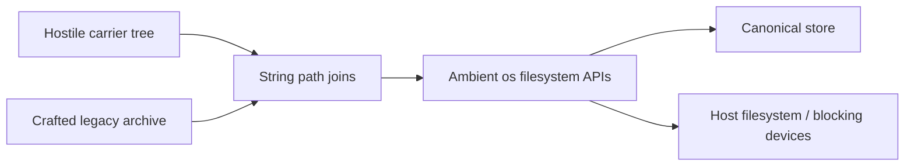
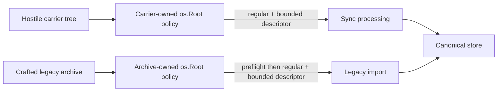
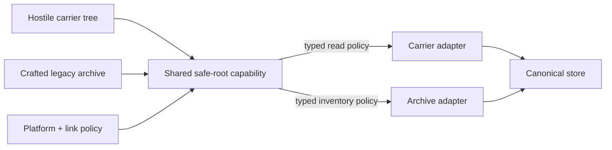

# Security Hardening Proposal: Keep Untrusted Trees Behind Root Capabilities

## Decision

Choose whether carrier and legacy-archive containment should remain
subsystem-owned or move into a shared safe-filesystem capability package. Both
options reject ambient descendant paths; the choice is whether their distinct
compatibility and lifecycle rules are mature enough to share one abstraction.

## Executive Recommendation

Option 1, **Subsystem-owned rooted access**, gives each consumer an `os.Root`
boundary, descriptor identity checks, explicit limits, and tests while keeping
carrier resume semantics separate from archive preflight semantics. Option 2,
**Shared safe-root capability**, centralizes no-follow opens, link policy,
bounded directory iteration, and platform behavior behind typed operations.

I recommend Option 1 for v0.7. It addresses the two observed capabilities at
their actual owners without forcing unlike workflows into one API. Option 2
becomes preferable when a third hostile-tree consumer appears, when hardlink or
bind-mount policy becomes supported, or when cross-platform behavior must be
certified in one place rather than documented per subsystem.

## Evidence

I inspected both sealed findings and the carrier/archive callers. The repeated
mechanism is ambient filesystem authority, but the safe state transitions are
not identical.

| Evidence | Finding | What it establishes |
| --- | --- | --- |
| `csf_adb83c6f7c60a4270cef81ff` | Hostile carrier entries can escape or block filesystem operations | Read, publish, fallback, removal, and resumable snapshots operated on attacker-controlled descendants using follow-link APIs. |
| `csf_ff3c60302e53c6c528fb82d3` | Legacy archive import follows unsafe descendant entries | Explicit import followed consumed metadata, notes, and resources and could discover unsafe resources after writes began. |

Observed source in `internal/synccarrier/directory.go` and `snapshot.go` needs
repeated operations over a mutable shared tree. Observed source in
`internal/archive/read.go` and `import.go` needs one preflight inventory followed
by canonical import. We infer that a root capability is common, while mutation,
resume, tolerance, and aggregate-limit policy remain subsystem concerns.

## Current Design And Failure Mode

At the scanned revision, validated names were joined onto an absolute root and
passed to `os.Stat`, `os.ReadFile`, `os.Open`, `os.WriteFile`, `os.Remove`, and
directory walkers. Name validation stopped `..`, but it did not stop a
descendant symlink, FIFO, hardlinked writable target, directory race, or file
growth after stat.

This exposed two kinds of failure. The carrier could make a long-running sync
process block or write outside its intended entry. A crafted archive could make
an explicit import read outside the selected tree and could reveal an unsafe
resource only after earlier canonical mutations. File hashes protect sync
content integrity, but they do not contain filesystem authority or bound work.

## Desired Invariants

- The user-selected root may be a trusted mount or alias; every descendant
  operation is relative to one pinned root capability.
- Every consumed file is a regular descriptor matching the lstat identity and
  remains within a per-file and aggregate work ceiling.
- Writable partial/fallback entries never modify a carrier-provided hardlinked
  inode; final symlinks and special files are rejected without blocking.
- Directory iteration allocates and processes bounded batches and stops after a
  declared scan ceiling, including ignored entries.
- Legacy import completes its consumed-entry preflight before any canonical
  mutation and does not re-enumerate a hostile resources directory afterward.
- Compatibility rules remain explicit: ignored legacy sidecars stay ignored,
  snapshots remain resumable, and large resources remain streamed.

## Constraints And Non-Goals

The configured root itself remains trusted and may be a symlink or mount.
v0.7 does not claim to reject bind mounts inside that trusted root. It rejects
writable snapshot hardlinks using link-count checks, while read-only carrier
hardlinks remain content-verified. Linux and Android are primary rooted
platforms; Plan 9/js `os.Root` differences are unsupported. Archive limits must
admit the proven 382,206-document scale and 16 GiB-class resources.

## Before Architecture

The before design grants ambient authority after a string join. Both callers
can reach the host filesystem or a blocking device through a descendant entry.

The critical edge is `Paths --> FS`: callers carry an unrestricted string, not
a capability that records which root and operation policy were approved.

## Options

### Option 1: Subsystem-Owned Rooted Access

Each subsystem opens the explicitly selected root and performs all descendant
operations through it. Carrier code owns mutable-tree concerns: no-follow
directory descriptors, bounded scans, artifact size checks, single-link
writable partials, staging, and non-atomic fallback. Archive code owns tolerant
inventory, consumed-entry cardinality, aggregate note/resource limits, and the
preflight-to-import handoff.

This option is attractive because the security primitive is shared conceptually
without hiding the different state machines. Carrier failures remain ordinary
skips or unavailable errors; archive failures abort an explicit operation
before persistence. The main concern is drift in low-level descriptor checks.
Review and tests must ensure every new operation uses the rooted helper rather
than ambient `os` calls.

| Change | Before | After | Security consequence | Cost |
| --- | --- | --- | --- | --- |
| Path authority | Absolute strings | Per-operation `os.Root` | Descendant links cannot escape the selected root | Root-relative helper code in two packages |
| File admission | Stat then follow-link open | lstat/open/fstat/SameFile + bounds | Symlinks, special files, swaps, and growth are rejected/bounded | Extra metadata calls |
| Directory work | Whole untrusted inventory | Bounded descriptor batches and ceilings | Memory/time are caller-bounded | Large invalid trees stop at a declared limit |
| Archive lifecycle | Resources rediscovered after writes | One preflight inventory supplies import | Known unsafe/cardinality input fails before mutation | Inventory retained in memory |

Rollback is code-local but would reopen root-escape and blocking behavior. The
operational rollback is to stop using the suspect carrier/archive and work from
a trusted copy, not to disable the checks.

### Option 2: Shared Safe-Root Capability

We introduce an internal package that returns typed handles such as
`ReadRegular(max)`, `OpenSingleLinkWritable(max)`, and
`IterateDirectory(batch, scanLimit)`. Platform-specific no-follow and link-count
logic lives there. Carrier and archive adapters still decide which entries are
meaningful and which aggregate/lifecycle rules apply.

The strongest case is recurrence control. A third importer, restore workflow,
or removable-media feature would not reimplement subtle descriptor ordering.
Platform certification and fuzzing would focus on one package. What gives me
pause is semantic overreach: a generic helper that promises “safe file” can
obscure whether it is safe for read, write, resume, or preflight. The API must
encode those distinctions or it merely moves ambiguity.

| Change | Before | After | Security consequence | Cost |
| --- | --- | --- | --- | --- |
| Descriptor checks | Duplicated helpers | Typed capability operations | New consumers inherit reviewed ordering | New API and migration |
| Platform policy | Package comments/build files | One policy matrix | Unsupported semantics fail closed consistently | Cross-platform test burden becomes centralized |
| Domain lifecycle | Visible in each package | Split between capability and adapter | Low-level drift decreases | Incorrect abstraction can hide domain-specific gaps |
| Rollout | Focused tactical patches | Incremental caller migration | Old and new paths must coexist safely | Temporary duplicate controls |

We would migrate one read-only operation first, compare behavior and profiles,
then move writable partials only after hardlink and removable-media tests pass.
Rollback keeps the subsystem helpers until the shared capability has complete
coverage; it must never replace them in one sweeping change.

## Comparison

| Dimension | Option 1: Subsystem roots | Option 2: Shared capability |
| --- | --- | --- |
| Security | Improves, high confidence, source-derived; direct findings addressed but helper drift remains | Improves recurrence resistance, medium confidence, source-derived; API design can still omit domain policy |
| Performance | Small metadata overhead, medium confidence; profile large carrier/archive scans | Similar expected I/O, low confidence; abstraction overhead likely neutral; benchmark identical workloads |
| Memory | Bounded inventories, high confidence; archive retains validated names/notes | Neutral to slight improvement possible through iterator reuse, low confidence; compare peak RSS at 382k notes |
| Reliability | Improves deterministic rejection, medium confidence; platform behavior remains package-specific | Potentially improves consistent failure modes; shared bug has broader blast radius; fault-inject both consumers |
| Operability | Neutral; errors remain subsystem-specific | Improves policy inventory but adds shared diagnostics; review operator messages and telemetry |
| Migration | Neutral, focused changes | Regresses initially; two callers and platform helpers migrate; stage and retain rollback paths |

Option 2 is not automatically safer merely because it is shared. It wins when
the number of consumers or supported platform policies makes duplicated
low-level review more dangerous than a shared component's blast radius.

## Recommendation

I recommend Option 1 for v0.7. Two consumers with materially different
lifecycle rules are not yet enough evidence for a stable general API. I would
switch to Option 2 after a third consumer appears or after the project approves
a stronger hardlink/bind-mount/cross-platform policy that deserves one owner.

## Evidence Coverage And Residual Risk

| Finding | Option 1 | Option 2 | Tactical fix remains necessary |
| --- | --- | --- | --- |
| `csf_adb8...` — Hostile carrier paths | Addresses | Addresses after migration | Yes; root, bounds, fallback, directory, and partial checks remain |
| `csf_ff3c...` — Unsafe legacy archive paths | Addresses | Addresses after migration | Yes; preflight and aggregate/domain policy remain in archive adapter |

Residual risk includes concurrent same-user filesystem mutation between checks,
trusted-root bind mounts, read-only hardlinks, and weaker unsupported-platform
semantics. Descriptor identity, content hashes, single-link writable checks,
and fail-closed errors narrow those risks but do not make a hostile filesystem
transactional.

## Migration And Rollout

Option 1 ships through focused package changes and regression suites, with
limits documented as public compatibility constraints. Rollback means stopping
the operation and using a trusted copied tree if the platform cannot provide
the required semantics.

Option 2 starts with a no-write rooted reader and contract tests across Linux,
Android, macOS, and Windows. Carrier writes and snapshot resume migrate last.
Old helpers remain until source search and mutation tests show no ambient path
operations; rollback selects the old helper implementation without changing
on-disk layout.

## Validation Plan

- Test final and ancestor symlinks, FIFO/socket/device entries, hardlinked
  writable partials/fallback targets, path swaps, file growth, and removal.
- Test bounded invalid directory populations and exact accepted-entry ceilings
  without whole-directory allocation.
- Test archive count, per-file, aggregate-note, aggregate-resource, and total
  scanned-entry limits before any canonical mutation.
- Preserve ignored sidecars, malformed skipped resources, >16 MiB valid
  resources, the 382,206-document evidence scale, non-atomic carrier fallback,
  and resumable >17 MiB snapshots.
- Cross-build and run platform filesystem tests where the target supports
  `os.Root`; document rather than infer unsupported semantics.
- Profile wall time, allocations, peak RSS, and bytes read for representative
  valid and adversarial trees before selecting Option 2.

## Implementation Work Packages

Option 1 comprises carrier rooted operations and bounded iteration, archive
rooted preflight and aggregate inventory, platform link/directory helpers,
regressions, and documentation. Option 2 would add the shared capability API,
platform contract suite, staged read/write migration, source enforcement, and
rollback adapters. No Option 2 implementation is authorized by this portfolio.

## Open Questions

- Are in-root bind mounts or read-only hardlinks in scope for v0.8?
- Which non-Linux platforms must provide the same no-follow/nonblocking
  guarantees before a release may claim parity?
- Does another planned importer or restore workflow justify a shared
  capability, or can it reuse archive-v2's stricter reader instead?
